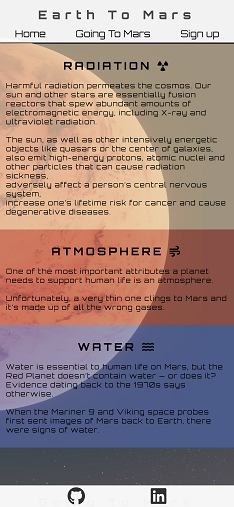
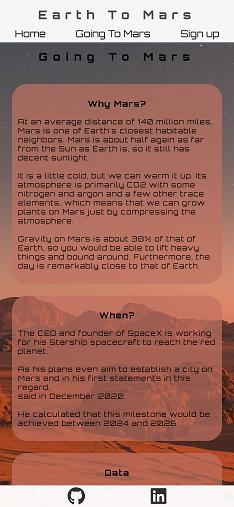
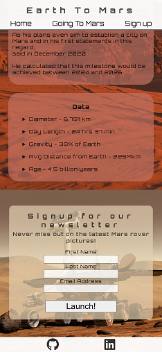
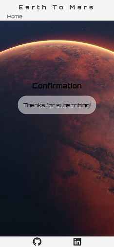
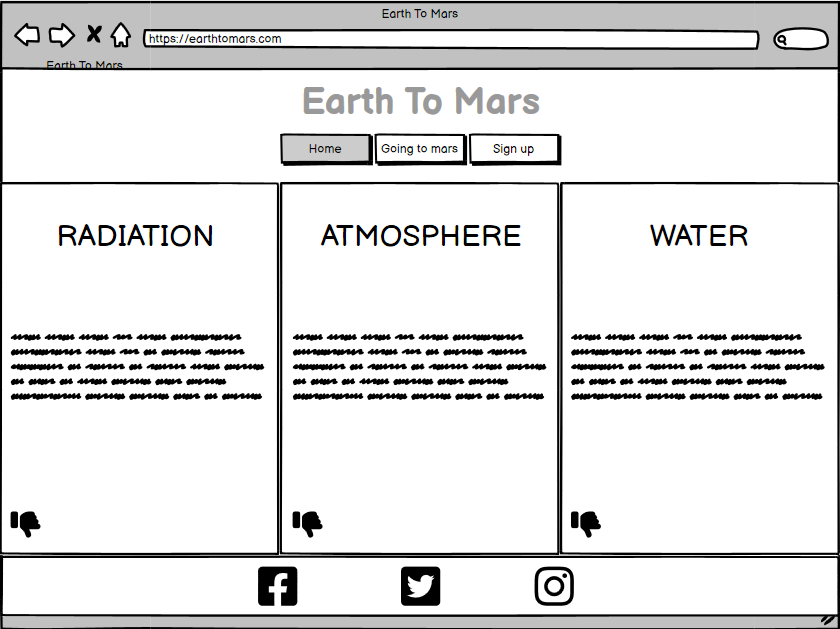
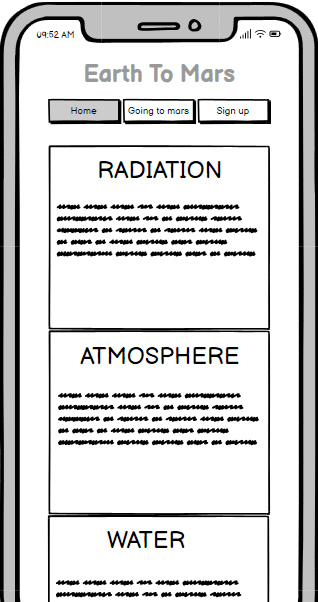
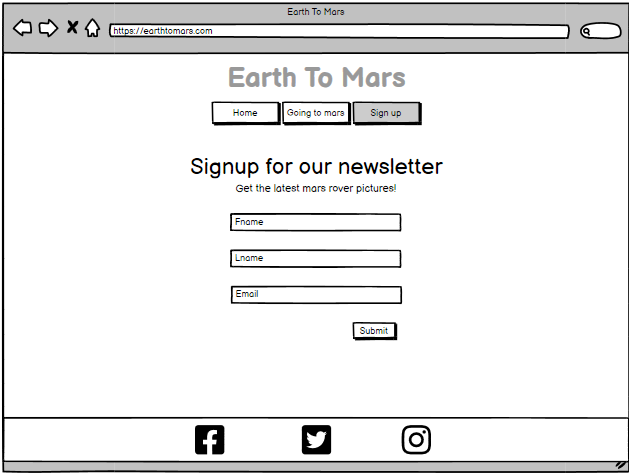

# **Earth To Mars** 

Web Address [Eart To Mars](https://stojj2.github.io/Portfolio-Project-1/)

## **Purpose** 
Earth To Mars is a website that aims to spread information about humanity's progress towards becoming multiplanetary. Most likely planet candidate today is Mars.   This website will describe problems that exist today with living on a planet other than Earth and also have a newsletter that sends out exciting news about what is happening on Mars.

## **User Stories** 

- As a visiting user, I would like to have one easy to use navigation bar
- As a visiting user, I want the website to be readable on small screens, for example a phone
- As a visiting user, I would like to have a newsletter on Mars activities

## **Features** 

- ### Navigation bar 
  
  - Navigation bar that will help the user navigate to different sections of the page,  navigation bar includes Eart To Mars header
  - Navigation bar is always visible
  - The buttons on the navigation bar will be highlighted when hovered on

- ### Biggest challenges 
   
   - Three informative boxes with the biggest challenges of populating a new world
   - Each box have a transparent color for text to be more readable and the background still visible through them
   
- ### Going To Mars 
   
   - Section with picture and information about Mars and why we aim for that specific planet
   - Going to Mars section is divided into three separate fields of text for making the information easier to read. Each textfield have a transparent background for readability

- ### Footer 
  
  - Footer section will have clickable icons that take the user to social media pages
  - Footer section will always be visible

- ### Newsletter 
  
  - The newsletter sign up form is designed to make it easy to se where information needs to be written in
  - Signup form will navigate the user to a confirm page when all information is filled in and the "Launch" button is pressed

- ### Confirmation page
   

- ### Responsive Design 

  

  - Entire web page is responsive and will work on resolutions used by Pc, tablet and phone

## **Future Features** 
- Ranking list of which private company invests the most in Mars missions

## **Fonts and color** 
- Webpage will use three colors F4F1F1, 8B8399 and 5C7AAD. Most text will be black

- Font for the entire webpage is Orbitron
## **Wireframe** 

  - ### Homepage 
  
    
    

  - ### Going To Mars 
    

  - ### Signup 
    

## **Testing** 

### Code validation 
- #### W3C HTML Validator 
    - [index.html](https://validator.w3.org/nu/?doc=https%3A%2F%2Fstojj2.github.io%2FPortfolio-Project-1%2Findex.html) 
    - [confirmation.html](https://validator.w3.org/nu/?doc=https%3A%2F%2Fstojj2.github.io%2FPortfolio-Project-1%2Fconfirmation.html)
  
- #### W3C CSS Validator 
    - [style.css](https://jigsaw.w3.org/css-validator/validator?uri=https%3A%2F%2Fstojj2.github.io%2FPortfolio-Project-1%2Fassets%2Fcss%2Fstyle.css&profile=css3svg&usermedium=all&warning=1&vextwarning=&lang=sv)

- #### Lighthouse desktop 
    
    
- #### Lighthouse mobile 
    
    
### Test cases 

### Fixed bugs 
  
### supported screens and browsers

## **Credit**   

  - Tracy Staedter for her Mars Exploration [article](https://now.northropgrumman.com/mars-exploration-3-problems-science-needs-to-solve-first/)
  - SpaceX for [information](https://www.spacex.com/human-spaceflight/mars/)
  - Marca:s Elon Musk [interview](https://www.marca.com/en/lifestyle/us-news/2022/03/19/6236048cca474106568b456d.html)

