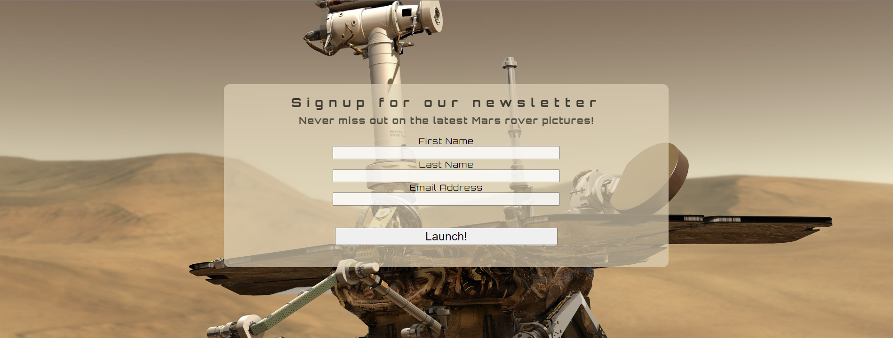
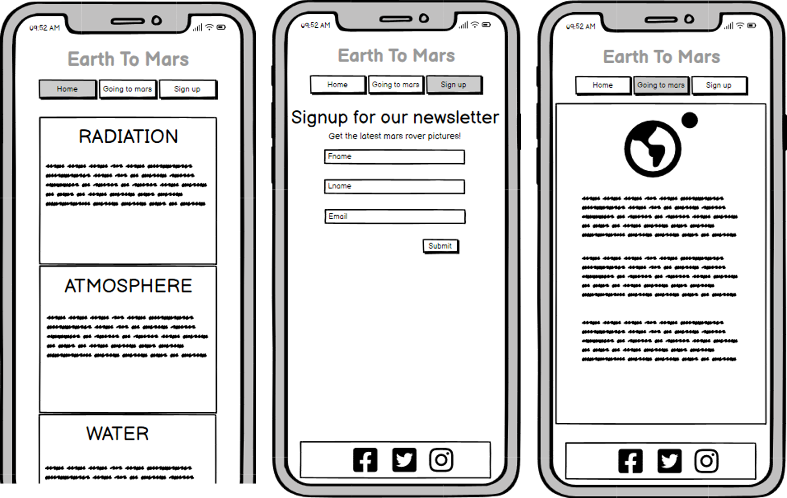
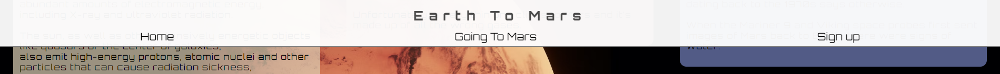
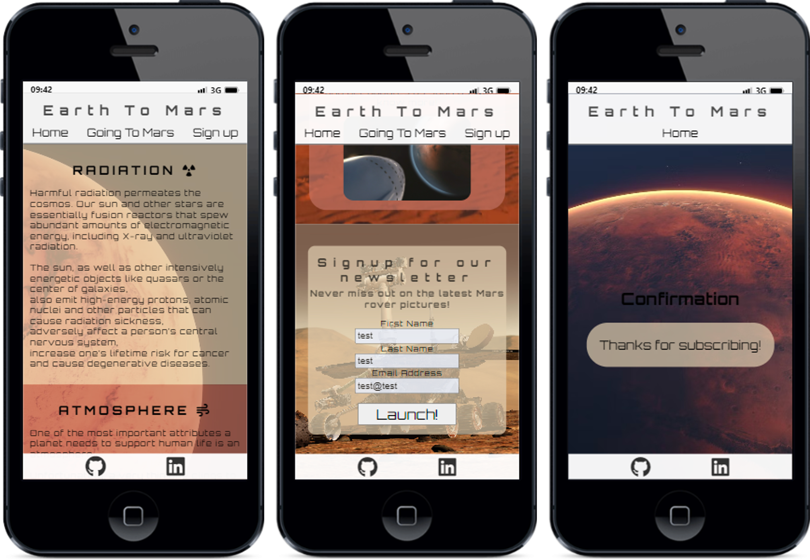

# **Earth To Mars** 

 **Visit [Eart To Mars](https://stojj2.github.io/Portfolio-Project-1/)**
 
## **Purpose** 
Earth To Mars is a website that aims to spread information about humanity's progress towards becoming multiplanetary. Most likely planet candidate today is Mars.   This website will describe problems that exist today with living on a planet other than Earth and also have a newsletter that sends out exciting news about what is happening on Mars.

## **User Stories** 

- As a visiting user, I would like to have one easy to use navigation bar
- As a visiting user, I want the website to be readable on small screens, for example a phone
- As a visiting user, I would like to have a newsletter on Mars activities

## **Features** 

- ### Navigation bar 
  
  - Navigation bar that will help the user navigate to different sections of the page,  navigation bar includes Eart To Mars header
  - Navigation bar is always visible
  - The buttons on the navigation bar will be highlighted when hovered on

- ### Biggest challenges 
   
   - Three informative boxes with the biggest challenges of populating a new world
   - Each box have a transparent color for text to be more readable and the background still visible through them
   
- ### Going To Mars 
   
   - Section with picture and information about Mars and why we aim for that specific planet
   - Going to Mars section is divided into four separate fields of text for making the information easier to read. Each textfield have a transparent background for readability

- ### Footer 
  
  - Footer section have clickable icons that take the user to social media pages
  - Footer section will always be visible

- ### Newsletter 
  
  - The newsletter sign up form is designed to make it easy to se where information needs to be written in
  - Signup form will navigate the user to a confirm page when all information is filled in and the "Launch" button is pressed

- ### Confirmation page
   
  - You will be navigated to this page when you sign up for newsletter to indicate that everything worked as it should

- ### Responsive Design 

  **phone** 

  

  **Tablet** 

  
  - The website is designed to be easy to read on a smaller screen size
## **Future Features** 
- Ranking list of which private company invests the most in Mars missions

## **Fonts and color** 
- Webpage will use three main colors
  - #e2d0b1b3
  - #c07161b3
  - #6b81c3b3
- Black and white
  - #fffffff2
  - #000000cc
    - Black color will be used for most of the text

- The font for the entire webpage is [Orbitron](https://fonts.google.com/specimen/Orbitron)
## **Wireframe** 

  - **Homepage**  
    
  - **Going To Mars**  
    
  - **Signup**  
    
  - **Phone**  
    

## **Testing** 

### **Code validation**
- W3C HTML Validator 
    - [index.html](https://validator.w3.org/nu/?doc=https%3A%2F%2Fstojj2.github.io%2FPortfolio-Project-1%2Findex.html) 
    - [confirmation.html](https://validator.w3.org/nu/?doc=https%3A%2F%2Fstojj2.github.io%2FPortfolio-Project-1%2Fconfirmation.html)
  
- W3C CSS Validator 
    - [style.css](https://jigsaw.w3.org/css-validator/validator?uri=https%3A%2F%2Fstojj2.github.io%2FPortfolio-Project-1%2Fassets%2Fcss%2Fstyle.css&profile=css3svg&usermedium=all&warning=1&vextwarning=&lang=sv)

- Lighthouse desktop 
    
    
- Lighthouse mobile 
    
    

### **Test cases** 
  

  - **`As a visiting user, I would like to have one easy to use navigation bar`** 
    - Navigation Bar
      - Testing navigation bar buttons, mouse over function and that they are easy to navigate with. Navigation bar will always be visible all the time and this makes it realy easy to always find the navigation bar on the screen
      

        

  - **`As a visiting user, I want the website to be readable on small screens, for example a phone`**
    - Test responsiveness on small screen 

      - Smalest resolution tested is 320x568 
      
        

  - **`As a visiting user, I would like to have a newsletter on Mars activities`**
    - Sign Up
      - Testing that the Sign Up form will navigate to the confirmation.html after all information is filled in correct and the Launch button is pressed

       - Picture is showing one error because the email address do not include a @
       
       - Picture is showing the right data filled in 
       
       - Navigation works fine!
       
     
  - **Testing the website on Apple's Safari browser** 

    - Error was found in Safari iphone browser, Launch button is blue 
    
       

    - Safari desktop browser does not show the same error 

       

### Fixed bugs 
  - W3C validator indicate on one error in HTML code for index.html
   
     - The error where corrected and W3C did completed with no errors in the index.html file  

### Unfixed bugs 
   -  Apple's webbrowser Safari for phones do show a blue Launch button on Sign Up page

## Technology 
  - **Balsamiq**
    - Balsamiq Wireframes where used to draw wireframes for this project
  - **GitPod**
    - GitPod where used for writing all code 
  - **GitHub**
    - For storing the code GitHub where used
  - **GitHub Pages**
    - GitHub pages where used for hosting the website
  - **Chrome DevTools**
    - Google chrom built in devtools where used for testing 
  - **Mobile FIRST**
    - Mobile First Chrome extension where used for screenshots

## Supported screens and browsers
  - For this web page different screen sizes were tested and no errors were found. This specific sizes were validated
    - **Desktop** 1920×1080
      - For this resolution the media query will style the website with new style
    - **Tablet** 768x1024
    - **Mobile** 360x640
  - Browsers 
    - Google Chrom
## **Deployment**
 ### GitHub Pages
- The site was deployed to GitHub pages. The steps to deploy are as follows:
- In the GitHub repository, navigate to the Settings tab
- From the source section drop-down menu, select the Master Branch
- Once the master branch has been selected, the page will be automatically refreshed with a detailed ribbon display - to indicate the successful deployment.
The live link can be found here - https://stojj2.github.io/Portfolio-Project-1/index.html

 ### GitPod
  - The site was coded using GitPod. The steps to deploy is as following:
  - In the GitHub repository, press the green GitPod button for transfer the project to GitPod enviroment
    - NOTE!
      - [GitPod webbrowser plugin](https://chrome.google.com/webstore/detail/gitpod-always-ready-to-co/dodmmooeoklaejobgleioelladacbeki) needs to be installed to your browser to get this button. 
## **Credit**

  ### Content
  - Tracy Staedter for her Mars Exploration [article](https://now.northropgrumman.com/mars-exploration-3-problems-science-needs-to-solve-first/)
  - SpaceX for [information](https://www.spacex.com/human-spaceflight/mars/)
  - Marca:s Elon Musk [interview](https://www.marca.com/en/lifestyle/us-news/2022/03/19/6236048cca474106568b456d.html)
  ### Media
 - Pictures from [Unsplash](https://unsplash.com/) where used on this website
 - Pictures from [Pexel](https://www.pexels.com/sv-se/) where used on this website
 - On this website icons from [Fontawesome](https://fontawesome.com/start) where used
 - Font [Orbitron](https://fonts.google.com/specimen/Orbitron) is from Google fonts

  ### Other
  - Very Much inspiration came from Code Institutes [Love Running](https://github.com/Code-Institute-Solutions/love-running-2.0-sourcecode) project. The HTML code was in great help for implementing the sign-up form in this website

  - Code Institute student [template](https://github.com/Code-Institute-Org/gitpod-full-template) for Gitpod was used for this project

